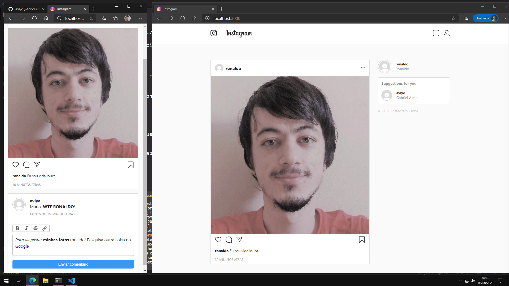

# 📷 instagram-web-rails 💎

An instagram clone build with **Ruby On Rails**.



## Requirements

* Ruby version: 2.7.1
* Rails version: >= 6.0

* System dependencies:
  - Docker | [Get Docker Here](https://www.docker.com/)
  - An updated browser with BROWSER system variable setup for letter_opener browser commands

  ```zsh
    # Config used for WSL 2
    # mkdir ~/.local/bin
    # ln -s "/mnt/c/Program Files (x86)/Microsoft/Edge/Application/msedge.exe" ~/.local/bin/msedge

    BROWSER=~/.local/bin/msedge
  ```
  - ImageMagick

  ```
    sudo apt install imagemagick -y
  ```

## Configuration

```zsh
docker-compose -f "docker-compose.yml" up -d --build
```

## Database creation

```zsh
rails db:migrate
```

## Services used (job queues, cache servers, search engines, etc.)

- Docker (Container)
- Redis (Cache)
- PostgreSQL (Database SQL)
